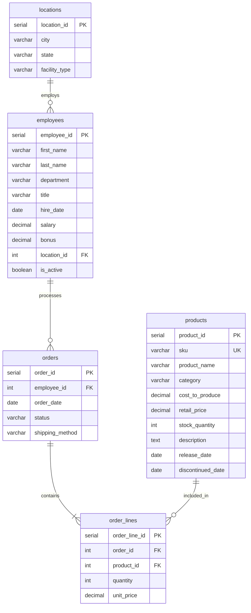

# CMAP 1815: Database Schema & Dataset Specification

## Primary Database Environment
- **RDBMS Engine:** PostgreSQL 16
- **Hosting / Interface:** GitHub Codespaces pre-configured container with PostgreSQL server, accessible via terminal `psql $DATABASE_URL` or the VS Code SQLTools extension.
- **Default Database:** `mydb`
- **Default Schema:** `public`

---

## Entity Relationship Diagram (ERD)

---

## Data Dictionary

### 1. `locations` Table
Defines organizational facilities and offices across the company.
| Column | Type | Constraints | Description |
| :--- | :--- | :--- | :--- |
| `location_id` | SERIAL | PRIMARY KEY | Unique surrogate identifier for the location |
| `city` | VARCHAR(50) | NOT NULL | City name (e.g. Cheyenne, Denver, Chicago) |
| `state` | VARCHAR(2) | NOT NULL | 2-letter state abbreviation (e.g. WY, CO, IL) |
| `facility_type` | VARCHAR(50) | NULL | Type of facility (Headquarters, Warehouse, Retail Store, R&D) |

### 2. `employees` Table
Contains workforce records, roles, financial compensation, and organizational assignment.
| Column | Type | Constraints | Description |
| :--- | :--- | :--- | :--- |
| `employee_id` | SERIAL | PRIMARY KEY | Unique employee identification number |
| `first_name` | VARCHAR(50) | NOT NULL | Employee first name |
| `last_name` | VARCHAR(50) | NOT NULL | Employee last name |
| `department` | VARCHAR(50) | NULL | Department (Security, Research, Sales, Management, Operations, Support, Engineering) |
| `title` | VARCHAR(50) | NULL | Job title (e.g. Director, Field Investigator, Lead Scientist) |
| `hire_date` | DATE | NULL | Date of hire (YYYY-MM-DD) |
| `salary` | DECIMAL(10,2)| NULL | Annual base salary in USD |
| `bonus` | DECIMAL(10,2)| NULL (Can be NULL) | Annual performance bonus; NULL indicates no bonus |
| `location_id` | INT | FK -> locations(location_id) | Facility where employee is assigned |
| `is_active` | BOOLEAN | DEFAULT TRUE | Active employment status flag |

### 3. `products` Table
Inventory catalog tracking goods, production economics, and lifecycle dates.
| Column | Type | Constraints | Description |
| :--- | :--- | :--- | :--- |
| `product_id` | SERIAL | PRIMARY KEY | Unique product identifier |
| `sku` | VARCHAR(20) | UNIQUE, NOT NULL | Stock Keeping Unit code |
| `product_name` | VARCHAR(100)| NOT NULL | Name of the product |
| `category` | VARCHAR(50) | NULL | Category (e.g. Electronics, Apparel, Books) |
| `cost_to_produce` | DECIMAL(10,2)| NULL | Internal manufacturing cost |
| `retail_price` | DECIMAL(10,2)| NOT NULL | Selling price |
| `stock_quantity` | INT | NOT NULL | Units currently in warehouse inventory |
| `description` | TEXT | NULL | Detailed item description |
| `release_date` | DATE | NULL | Date product was brought to market |
| `discontinued_date` | DATE | NULL | Date product was retired (NULL if actively sold) |

### 4. `orders` Table
Header-level transaction records tracking orders and responsible employees.
| Column | Type | Constraints | Description |
| :--- | :--- | :--- | :--- |
| `order_id` | SERIAL | PRIMARY KEY | Unique order number |
| `employee_id` | INT | FK -> employees(employee_id) | Sales rep or staff member responsible for order |
| `order_date` | DATE | NOT NULL | Date order was placed |
| `status` | VARCHAR(20) | DEFAULT 'Completed' | Order status (Completed, Pending, Cancelled) |
| `shipping_method`| VARCHAR(50) | NULL | Carrier/method (Standard, Express, Overnight) |

### 5. `order_lines` Table
Line-item details representing individual products and quantities per order.
| Column | Type | Constraints | Description |
| :--- | :--- | :--- | :--- |
| `order_line_id` | SERIAL | PRIMARY KEY | Unique line item record identifier |
| `order_id` | INT | FK -> orders(order_id) ON DELETE CASCADE | Parent order |
| `product_id` | INT | FK -> products(product_id) | Item ordered |
| `quantity` | INT | NOT NULL, CHECK (quantity > 0) | Number of units ordered |
| `unit_price` | DECIMAL(10,2)| NOT NULL | Historical unit price at time of sale |

---

## Secondary Benchmark Dataset: Superstore
- **File:** `legacy/activities/archive_units/3_Joins/superstore.csv` (and `shared_assets/datasets/`)
- **Use Case:** Used in Units 3 and 4 to practice enterprise data loading (`COPY`), broad cross-regional analysis, and reporting on thousands of real-world retail transactions.
